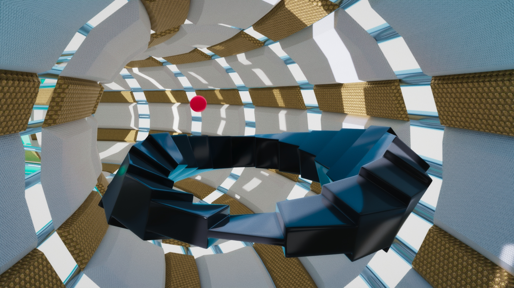
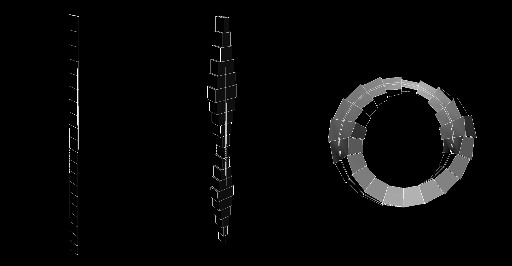
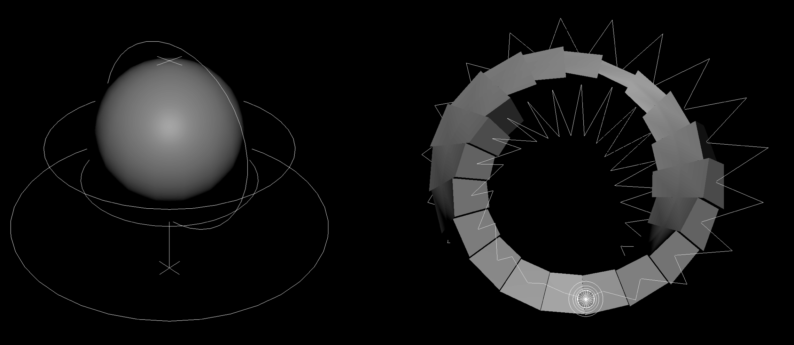
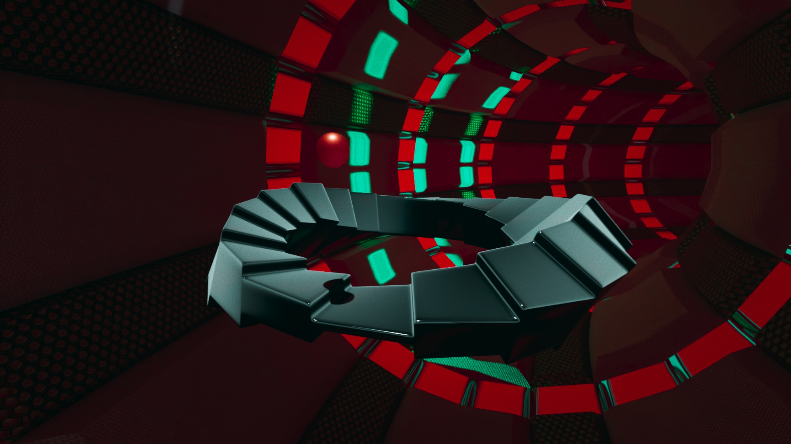
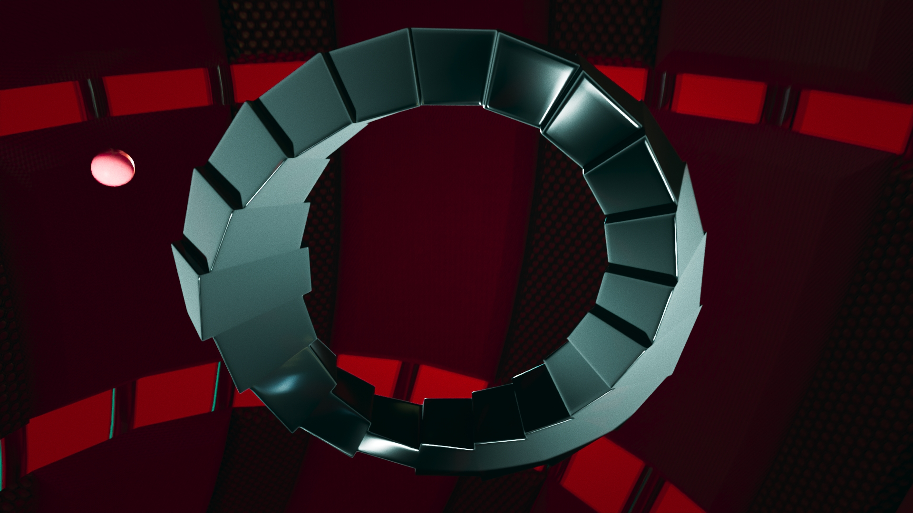

# CGI Tools — First Assessment

The project procedurally generates a infinite Möbius-style stair mesh and animates a bouncing ball rig that interacts with the stair surface using face normals for orientation.

## Project Overview

This tool demonstrates procedural modelling, rigging, and animation in Autodesk Maya using:

- `maya.cmds`
- `maya.api.OpenMaya`
- `numpy`

The main goal is to explore geometry-driven animation, where a bouncing ball follows a path derived from mesh face centers and aligns its rotation to face normals to maintain correct orientation during motion.

---



---

## Core Features

### Möbius Stair Generator
- Procedurally creates a stair-like strip mesh
- Applies extrusion, twist, and bend deformers
- Identifies walkable / bounceable faces based on face normal direction
- Computes ordered face centers and normals for animation control


 


### Bouncing Ball System
- Creates a polygon sphere with a simple rig:
  - Global control
  - Rotation control
  - Squash & stretch scale control
- Computes bounce trajectories using face centers and interpolated apex points
- Animates translation, rotation, and scale over time
- Aligns the ball’s orientation to surface normals using quaternion-based rotation.

 


### Animation Logic
- Bounce arcs are computed using triangle paths `(contact → apex → contact)`
- Squash and stretch is applied on impact and takeoff
- Rotation continuity is preserved across frames

---



---

### Project Structure
```text
CGI_Tools_First_Assessment/
├── Classes/
│ ├── Ball.py # Ball creation, rigging, and bounce animation logic
│ └── Mobius_Stair.py # Procedural stair generation and face analysis
│ ├── versions&experiments/ # Experimental and prototype code that shows development process
├── utils/ 
│ └── maya_helpers.py # Scene cleanup function
│ └── run_in_maya.py # Code to run Repo in Maya
├── media/ # Videos and Images that show development process
├── main.py
├── pyproject.toml
└── README.md
```

## Experiments & Versions
- Early prototypes, tests and alternative implementations that show my development process.
- This files can be copied and paste in Maya Script Editor to see their individual results. 

---



---


### How to Run
1. Open Autodesk Maya.
2. Make sure Maya’s Python environment can access this repository.
3. Copy and paste the run_in_maya.py in the python script editor in Maya.
4. Update the project path.
5. Hit run.
